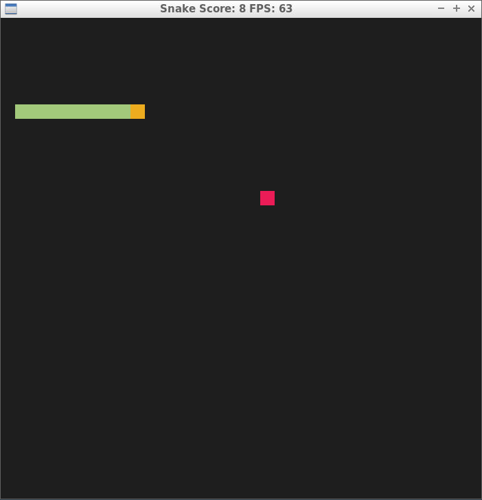

# Snake Game Project

This is C++ application `capstone project` I clone it from [Udacity](https://github.com/udacity/CppND-Capstone-Snake-Game.git)
And I extend the snake game with some features for it.
Take a look at this picture which is beginning game.

# Picture Of Game

# Source Code Files Details
* main.cpp >>> contain run the game method after create frames, then include renderer and controller objects.
* game.h and game.cpp >>> declear then define snake object.
* snake.h and snake.cpp >>> create snake object then update method to start the game.
* renderer.h and renderer.cpp >>> create and update window, frames and objects.
* controller.h and controller.cpp >>> Handel Inputs from user.

## Dependencies for Running Locally
* cmake >= 3.7
  * All OSes: [click here for installation instructions](https://cmake.org/install/)
* make >= 4.1 (Linux, Mac), 3.81 (Windows)
  * Linux: make is installed by default on most Linux distros
  * Mac: [install Xcode command line tools to get make](https://developer.apple.com/xcode/features/)
  * Windows: [Click here for installation instructions](http://gnuwin32.sourceforge.net/packages/make.htm)
* SDL2 >= 2.0
  * All installation instructions can be found [here](https://wiki.libsdl.org/Installation)
  >Note that for Linux, an `apt` or `apt-get` installation is preferred to building from source. 
* gcc/g++ >= 5.4
  * Linux: gcc / g++ is installed by default on most Linux distros
  * Mac: same deal as make - [install Xcode command line tools](https://developer.apple.com/xcode/features/)
  * Windows: recommend using [MinGW](http://www.mingw.org/)

## Steps
In this project, I extend this snake game with some features, To build and run the application,
first make the steps bellow:

# Build and Run Project
1. Clone this repo.
2. Make a build directory in the top level directory: `mkdir build && cd build`
3. Compile: `cmake .. && make`
4. Run it: `./SnakeGame`.

# conclusion
This project let us know how to create C++ application with best structure and create modern models and high secure, use and control memory with best way.
